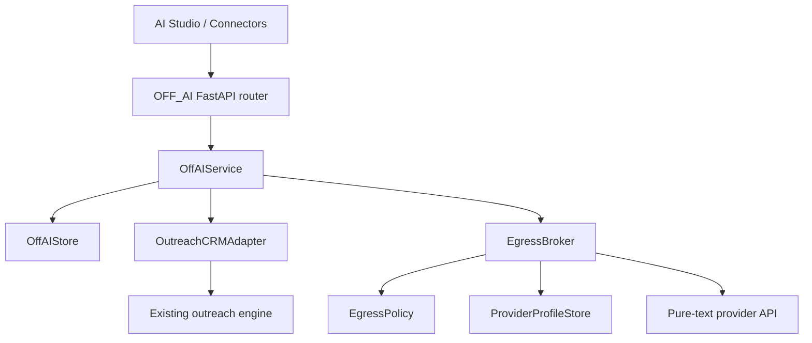
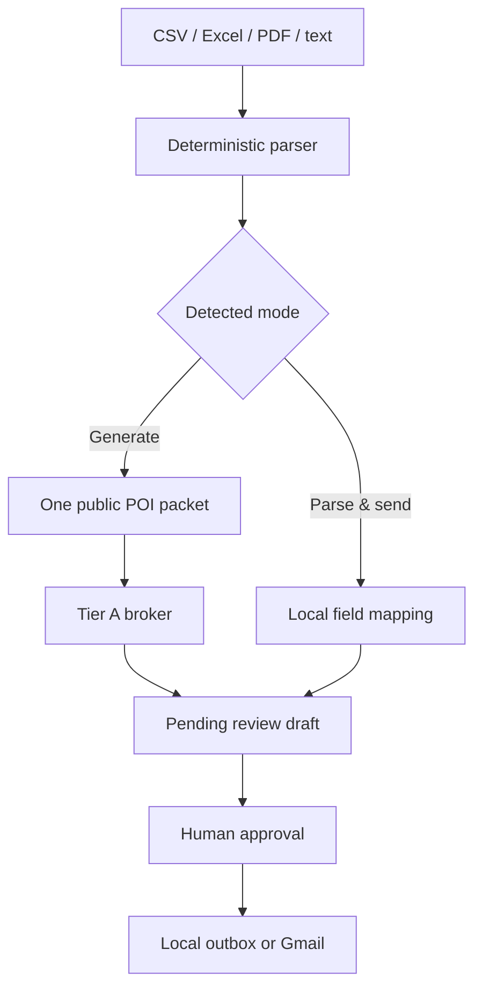

# OFF_AI architecture

OFF_AI is an extractable application package inside OFF_CRM. Its Python boundary is `offsetx_apollo_builder/off_ai/`; its user interface is `frontend/src/pages/AIStudio.tsx` and `frontend/src/pages/Connections.tsx`.

## System shape



The model-facing path ends at `EgressBroker.dispatch()`. Providers receive text inputs and return text. They receive no callback, tool, function, credential, file, retrieval interface, or database handle.

## Package responsibilities

| Module | Responsibility |
|---|---|
| `off_ai/schema.py` | OFF_AI-owned SQLite tables |
| `off_ai/store.py` | Projects, chats, deterministic state, intake jobs, egress audit, quotas, activity, recommendations |
| `off_ai/policy.py` | Trust tiers, task/data rules, allowlist payload builders, scanner, PII backstop, sandbox command |
| `off_ai/broker.py` | Single provider gate, quota/cost selection, same-tier failover, exact audit |
| `off_ai/parsers.py` | Deterministic CSV/Excel/PDF/text inspection and masked previews |
| `off_ai/service.py` | Chat, campaign intake, exports, feedback workflow, narrow CRM adapter |
| `off_ai/connectors.py` | Gmail OAuth orchestration and connector status |
| `off_ai/tools.py` | Immutable GitHub tool registry and networkless Docker execution |
| `off_ai/api.py` | HTTP contracts under `/api/v1/ai` |

The existing CRM remains authoritative for campaigns, contacts, drafts, templates, messages, send state, replies, experiments, discovery, Apollo, and sales. OFF_AI does not duplicate those tables.

## Main interfaces

```python
class EgressBroker:
    def dispatch(
        self,
        *,
        task_type: str,
        fields: dict[str, Any],
        selected_profile_id: str = "",
        allow_failover: bool = True,
        conversation_id: str = "",
        message_id: str = "",
    ) -> BrokerResult: ...

class OutreachCRMAdapter:
    def commit_intake(
        self,
        *,
        job: dict[str, Any],
        campaign_name: str,
        daily_send_limit: int,
        selected_mode: str,
        selected_profile_id: str,
    ) -> dict[str, Any]: ...

    def owner_activity_record(self) -> dict[str, Any]: ...

class CampaignIntakeParser:
    def inspect(
        self,
        path: Path | str,
        *,
        template_text: str = "",
        selected_mode: str = "",
    ) -> dict[str, Any]: ...
```

`OutreachCRMAdapter` is the only intentional OFF_AI dependency on the existing outreach domain. Moving OFF_AI to another repository requires implementing an equivalent adapter, not rewriting its broker, policy, state, parser, or chat services.

## Provider call flow

1. The service names a registered `task_type`.
2. `EgressPolicy.rule()` resolves its data class and permitted tiers.
3. `build_payload()` starts empty and adds only fields allowed for that task.
4. `scan()` blocks email addresses, secrets, local paths, mailbox/CRM/context requests, owner domains, and forbidden internal field names.
5. `redact()` applies deterministic phone, national-ID-like, and IP-address backstops.
6. The broker removes providers that fail trust, task, enabled, provenance, quota, or cost rules.
7. Automatic routing sorts remaining profiles by declared input/output cost and priority.
8. Failover candidates must have the same effective trust tier. Tier C is never a failover.
9. The broker obtains the selected provider's runtime credential, performs one text call, validates the expected output shape, and records the result.

The provider adapter layer in `outreach/providers.py` supports OpenAI, Anthropic, OpenAI-compatible endpoints, and an owner-operated template HTTP service. Legacy host `local_command` profiles are refused by OFF_AI; local code must use the sandboxed tool path.

## Task contracts

| Task | Data class | Allowed tiers | Constructed fields |
|---|---|---|---|
| `public_general` | public | A, B, explicitly enabled C | prompt and prior egress-approved public chat messages |
| `outreach_draft` | person public | A | one public POI profile, approved positioning, template, code-generated instruction |
| `template_rewrite` | owner template | A | template, sample size, numeric reply rate |
| `masked_parse_fallback` | owner template | A | masked text and expected field names |
| `health_check` | public | A, B, explicitly enabled C | fixed connection check |

The current UI uses deterministic parsing only. The masked fallback contract exists for a future explicit-confirmation flow; raw files are never sent.

## Campaign intake



Inspection stores the private parse result locally and returns only the masked public preview to the browser. Generate mode refuses before campaign creation unless at least one eligible Tier A outreach model exists. Parse & send makes no provider call. Both paths:

- deduplicate against `old_pois`, previous outputs, and CRM contacts;
- queue missing addresses for Apollo;
- create one campaign with pending review drafts;
- cap intake-created campaigns at 20 sends/day;
- reuse the existing edit, bulk correction, scheduling, approval, and send path.

Optional public enrichment stays in the existing Lead Discovery/Apollo workflow and runs before intake. This avoids a second crawler or Apollo implementation inside OFF_AI.

## Runtime state

`off_ai_context_state` stores:

- current task;
- plan;
- done and pending steps;
- decisions;
- working drafts;
- entity facts;
- a rolling summary;
- revision and update time.

Writes are deterministic. Chat messages update the current task and bounded rolling summary; campaign commits update done/pending/entity fields. Providers cannot query this table. OFF_CRM may push a small set of messages already marked egress-approved, but it never exposes a memory or retrieval tool.

SQLite is retained because v0.11 is a local, single-user application. The table boundaries and JSON fields are designed to migrate to PostgreSQL/JSONB when multi-user hosting is introduced. Graphiti is intentionally absent until the stated multi-hop-query threshold is measured.

## Data model

| Table | Key contents |
|---|---|
| `off_ai_projects` | project metadata and approved public instructions |
| `off_ai_conversations` | project, model selection, task/data class, pin/archive state |
| `off_ai_messages` | raw local history, response identity, egress approval and retry link |
| `off_ai_context_state` | deterministic continuation state and rolling summary |
| `off_ai_attachments` | private local attachment metadata and content-addressed path |
| `off_ai_import_jobs` | mode, mapping, private result, masked preview, campaign result |
| `off_ai_egress_calls` | exact packet, hash, provider identity, outcome, response, tokens and cost |
| `off_ai_provider_usage` | local daily request/token/cost accounting |
| `off_ai_activity_records` | structured orchestration activity |
| `off_ai_template_recommendations` | numeric-performance rewrite awaiting human review |

The owner export joins existing CRM campaign/contact/message metadata with OFF_AI egress records. It includes contact, campaign, variant, timestamps, and reply state, but deliberately excludes message bodies and raw provider payloads.

## Feedback loop

The existing experiment report deterministically derives sends, replies, reply rate, lift, and confidence intervals. After at least 20 sends, an owner can request a rewrite. The model receives only:

- current template text;
- sample size;
- numeric reply-rate percentage.

The recommendation remains `pending_review` until approved or rejected. Approval records a decision; it does not silently replace a live template.

## Gmail boundary

Gmail OAuth state and PKCE handling live in `GmailConnectorManager`; token persistence remains in the mail module. Reply sync uses exact thread IDs created by OFF_CRM. It fetches reply metadata for those threads and never gives a model a Gmail token, mailbox search, thread, or reply body.

## Bring-your-own tools

`BringYourOwnToolRegistry` accepts only:

- public HTTPS GitHub repositories;
- a full immutable commit SHA;
- a version-pinned container image;
- a bounded command.

Preparation uses credential-free Git, no submodules, a detached exact commit, and a 200 MB source cap. Execution uses stdin, a read-only mount, `--network=none`, unprivileged user, dropped capabilities, no-new-privileges, resource/time/output caps, and no secrets. The tool run audit stores an input hash and length, not raw input.

## Build-time code graph

Graphify `0.9.25` is run with `--code-only`, `--no-label`, and no document/media pass. `.graphifyignore` excludes runtime data and common export/input formats. The checked graph contains source symbols only and is not connected to OFF_AI runtime state.
