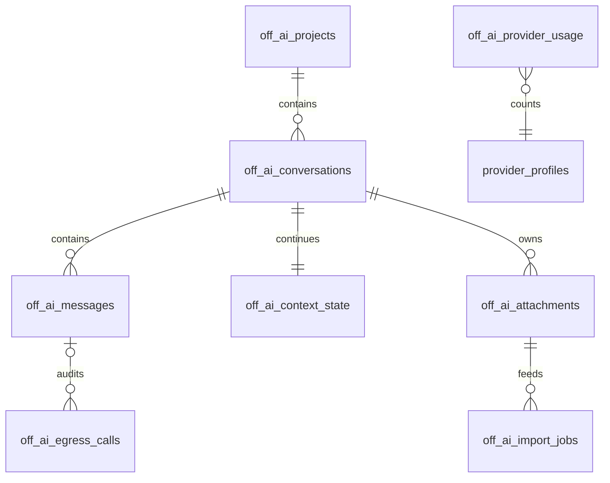

# OFF_AI manual reconstruction guide

Version: OFF_CRM 0.12.0
Implementation frozen: 2026-07-24

This document was written after the application, tests, production build, live
startup check, package build, and source graph were complete. It describes the
system that exists; it was not used as its implementation specification.

The purpose is to let an engineer rebuild OFF_AI by hand, without an AI coding
assistant, while preserving the security boundary and integration behavior.

## 1. Finished system

OFF_AI is an extractable package inside the existing OFF_CRM application. It
adds:

- a multi-model chat workspace;
- persisted projects, chats, messages, local continuation state, and exports;
- deterministic campaign-file intake;
- a trust-, quota-, and cost-aware model router;
- one model-egress broker and exact packet audit;
- in-app Gmail and provider connection management;
- a numeric reply-rate template improvement workflow;
- networkless, immutable GitHub tools;
- a source-only Graphify artifact;
- a right-side chat/project drawer independent from the global left navigation.

It reuses the existing CRM for contacts, campaigns, drafts, approval, sending,
reply stopping, experiments, Apollo, discovery, and sales. It does not create a
second outreach database.

## 2. Non-negotiable invariant

Models never pull. OFF_CRM pushes.

A provider receives one constructed text packet and returns text. No provider
receives:

- a Gmail token or mailbox query;
- a CRM, database, file, context, memory, evidence, or notebook handle;
- a retrieval function, tool callback, MCP connector, or function call;
- an email address, secret, local path, reply body, deal record, or full POI
  list.

Do not begin the provider adapter until the policy, scanner, and egress-audit
store exist. Do not add any provider call outside the broker.

## 3. Runtime and prerequisites

The completed local release uses:

- Python 3.10 or newer;
- FastAPI and Uvicorn;
- SQLite with foreign keys and WAL;
- pandas, openpyxl, pypdf, and pdfplumber-compatible parsing dependencies;
- React 19, TypeScript, Vite, and Vitest;
- `uv` for Python locking and execution;
- Node.js 24 or a compatible current Node release;
- Docker only for bring-your-own tool execution;
- Graphify `0.9.25` only at build time.

Install and verify the base application:

```powershell
uv sync --extra dev
cd frontend
npm ci
npm test
npm run build
cd ..
uv run pytest -q
uv run python run_off_crm.py
```

Open `http://127.0.0.1:8766`; check `/health/ready` and `/api/v1/meta`.

## 4. Repository map

| Path | Responsibility |
|---|---|
| `offsetx_apollo_builder/off_ai/schema.py` | OFF_AI-owned SQLite schema |
| `offsetx_apollo_builder/off_ai/store.py` | Projects, chats, state, intake, egress, quota, activity, recommendations |
| `offsetx_apollo_builder/off_ai/policy.py` | Task contracts, effective trust tiers, scanner, allowlist construction, PII backstop, Docker policy |
| `offsetx_apollo_builder/off_ai/broker.py` | Only model egress path, routing, failover, accounting, output checks |
| `offsetx_apollo_builder/off_ai/parsers.py` | Deterministic CSV/Excel/PDF/text inspection |
| `offsetx_apollo_builder/off_ai/service.py` | Use cases, exports, feedback, narrow CRM adapter |
| `offsetx_apollo_builder/off_ai/connectors.py` | Browser-safe Gmail OAuth coordination and connector routes |
| `offsetx_apollo_builder/off_ai/tools.py` | Immutable public GitHub tool registry and Docker runner |
| `offsetx_apollo_builder/off_ai/api.py` | Strict HTTP models and `/api/v1/ai` routes |
| `offsetx_apollo_builder/outreach/provider_profiles.py` | Config-driven provider registry and encrypted secrets |
| `offsetx_apollo_builder/outreach/providers.py` | OpenAI, Anthropic, OpenAI-compatible, and template HTTP adapters |
| `offsetx_apollo_builder/outreach/engine.py` | Existing draft/review/send domain reused through a broker adapter |
| `offsetx_apollo_builder/outreach/gmail.py` | Gmail transport and exact CRM-thread reply sync |
| `frontend/src/pages/AIStudio.tsx` | Chat, model selection, projects, right drawer, intake, dictation, packet inspector |
| `frontend/src/pages/Connections.tsx` | Visible Connectors page for Gmail, providers, audit, exports, and tools |
| `frontend/src/App.tsx` | Global left navigation and independent close/reopen state |
| `frontend/src/types.ts` | Client contracts |
| `frontend/src/styles.css` | Shared and responsive OFF_CRM design system |
| `tests/test_off_ai.py` | Domain and zero-access acceptance suite |
| `tests/test_off_ai_sandbox_runtime.py` | Real Docker network-wall test |
| `.graphifyignore` | Hard exclusions for runtime/user/document data |
| `scripts/build_code_graph.ps1` | Pinned, forced, code-only graph build |

The extraction seam is `OutreachCRMAdapter`. In a separate repository, replace
that adapter and preserve the rest of `off_ai/`.

## 5. Build order from zero

Follow this sequence. Run the named check before moving to the next step.

### Step 1 — restore and baseline the existing CRM

Start from a passing OFF_CRM v0.11 checkout. Confirm that campaigns, contacts,
drafts, approval, local outbox, Gmail, reply stop, Apollo, discovery, sales,
backups, and authentication work. Record existing table ownership and do not
duplicate it.

Check:

```powershell
uv run pytest -q
cd frontend
npm test
npm run build
```

### Step 2 — define the package boundary

Create `offsetx_apollo_builder/off_ai/__init__.py`. Keep all AI orchestration
inside this package. Define only one dependency on outreach:
`OutreachCRMAdapter`.

Wire no provider and no UI yet.

### Step 3 — add the OFF_AI schema

Create the ten tables listed in section 6. Keep OFF_AI schema versioning
separate from the existing outreach schema. Initialize it from `OffAIStore`.

Check that initialization is idempotent and foreign keys are enabled.

### Step 4 — implement deterministic storage

Build `OffAIStore` in this order:

1. transaction helpers;
2. projects;
3. conversations and messages;
4. deterministic context state;
5. attachments and import jobs;
6. egress audit;
7. usage accounting;
8. activity records;
9. template recommendations.

Use parameterized SQL. Allow updates only through explicit field sets. Convert
JSON columns at the store boundary.

### Step 5 — extend the provider registry

Reuse `ProviderProfileStore`; do not build a second vault. Add jurisdiction,
retention, declared tier, host/model provenance, check date, quotas, costs,
allowlisted task types, explicit Tier C switch, and fallback IDs.

Old and incomplete profiles must read as Tier D. Store API keys separately in a
Fernet-encrypted file. Expose `runtime_material()` only to the broker.

### Step 6 — implement policy before transport

Create task rules and effective-tier calculation. Then implement:

1. field-allowlist payload builders;
2. forbidden-key traversal;
3. email, secret, path, mailbox, CRM, and owner-domain detection;
4. deterministic PII backstop;
5. provider/task/tier refusal reasons;
6. sandbox command construction.

Write refusal tests now. A Tier B, C, or D profile must not draft outreach.

### Step 7 — implement the single broker

Create `EgressBroker`. Its dispatch sequence must be:

1. resolve a known task contract;
2. construct an empty-to-allowed payload;
3. scan the complete system-and-input packet;
4. apply the deterministic PII backstop;
5. filter providers by effective tier and task;
6. filter by RPM, RPD, and spend;
7. select the cheapest remaining provider;
8. create a pending audit record;
9. obtain runtime credentials;
10. make one pure-text call;
11. validate output;
12. finish the audit and usage row;
13. fail over only within the same effective tier.

No other module may call `create_provider()` or `runtime_material()`.

### Step 8 — build deterministic campaign parsing

Build header aliases and header scoring. Support:

- CSV with UTF-8 BOM, UTF-8, and CP1252;
- Excel with up to 20 sheets and misplaced headers in the first 15 rows;
- PDF text extraction;
- labeled plain-text blocks;
- Markdown pipe tables.

Return a private result for local storage and a separate masked public preview
for the browser. Detect Generate versus Parse & send. If both are valid, require
one owner choice. Never call a model during normal parsing.

### Step 9 — implement the CRM adapter

Use existing exclusion, Apollo queue, campaign, contact, draft, and event
methods. Generate one draft at a time. Keep the real email address local and
attach it to the CRM contact after provider output returns.

Before creating a Generate campaign, prove that an eligible Tier A
`outreach_draft` provider exists. A failed precheck must create no campaign.

### Step 10 — implement service use cases

Create `OffAIService` and compose store, profile store, broker, parser, CRM
adapter, and tool registry. Add chat send/retry, intake, exports, and template
recommendations.

Update local continuation state deterministically after user and assistant
events. Do not let a model query it.

### Step 11 — expose strict APIs

Build Pydantic models with `extra="forbid"` and bounded strings, list sizes,
uploads, limits, and numeric values. Mount the router under `/api/v1/ai`.

Map `PolicyViolation` to a readable failed-closed HTTP response in the existing
FastAPI exception layer.

### Step 12 — implement Gmail Connectors

Add OAuth state and PKCE coordination. Keep pending states in process for ten
minutes. Give the Gmail token path only to the mail module.

Reply sync must enumerate exact CRM-owned thread IDs. Do not restore broad
mailbox search in production mode.

### Step 13 — implement the frontend shell

Place AI first in `navigation`. Put Connectors under System. Remove Gmail and
model management from Settings.

Keep two state keys:

- `off-crm-left-nav-open`;
- `off-crm-ai-drawer-open`.

The left navigation and right history drawer must close and reopen
independently. On narrow screens, render both as overlays with visible close
controls. Preserve the legacy campaign local-storage value once, then migrate
it to `off-crm-active-campaign`.

### Step 14 — implement the AI workspace

Build:

- composer and Enter/Shift+Enter behavior;
- automatic or explicit eligible model selection;
- same-tier failover switch;
- provider metadata and usage;
- persisted messages;
- new, pin, rename, search, archive, and retry;
- projects and Markdown/HTML export;
- browser speech recognition with graceful fallback;
- exact packet inspection;
- deterministic file intake and masked preview;
- local context inspector.

Keep histories in the right drawer, not in the global left navigation.

### Step 15 — implement Connectors and feedback

The Connectors page must show trust tier, jurisdiction, retention, provenance,
terms date, task eligibility, health, quota, usage, and credential source at a
glance. Add Gmail, exact egress audit, owner exports, and GitHub tools.

The Experiments page may request a rewrite only after 20 sends. It sends the
template, sample size, and numeric reply rate—never reply text. Approval or
rejection is a separate human action.

### Step 16 — test, build, graph, and document

Run all acceptance and regression tests, build the frontend and Python
distributions, start the real server against a clean temporary database, then
run Graphify code-only. Write operational and rebuild documentation last.

## 6. OFF_AI data model

### Entity relationships



`provider_profiles` is a JSON registry rather than an OFF_AI SQLite table.
Existing CRM campaign/contact/draft tables remain authoritative and are joined
only through `OutreachCRMAdapter`.

### Table responsibilities

| Table | Primary key | Important fields |
|---|---|---|
| `off_ai_projects` | `id` | name, description, approved public instructions, archived |
| `off_ai_conversations` | `id` | project, model profile, task/data class, pinned, archived |
| `off_ai_messages` | `id` | role, local content, result state, model identity, egress call, approval |
| `off_ai_context_state` | `(scope_type, scope_id)` | task, plan, done, pending, decisions, drafts, facts, rolling summary, revision |
| `off_ai_attachments` | `id` | private name, type, size, hash, local path, purpose |
| `off_ai_import_jobs` | `id` | mode, mapping, private parse result, masked preview, result campaign |
| `off_ai_egress_calls` | `id` | exact packet/hash, provider facts, status, reasons, response, tokens, cost |
| `off_ai_provider_usage` | `(profile_id, usage_date)` | requests, input/output tokens, estimated cost |
| `off_ai_activity_records` | `id` | typed orchestration event and local structured payload |
| `off_ai_template_recommendations` | `id` | variant metrics, old/candidate text, review state |

### Important indexes

- projects: `(archived, updated_at DESC)`;
- conversations: `(archived, pinned DESC, updated_at DESC)` and
  `(project_id, archived, updated_at DESC)`;
- messages: `(conversation_id, created_at, id)` and `egress_call_id`;
- attachments: `(conversation_id, created_at DESC)`;
- import jobs: `created_at DESC`;
- egress: `created_at DESC, provider_profile_id` and
  `status, created_at DESC`;
- activity: `created_at DESC, record_type`;
- recommendations: `status, created_at DESC`.

### Main queries

Projects are ordered by their latest active conversation:

```sql
SELECT p.*,
       COUNT(c.id) AS conversation_count,
       MAX(c.updated_at) AS last_conversation_at
FROM off_ai_projects p
LEFT JOIN off_ai_conversations c
  ON c.project_id = p.id AND c.archived = 0
WHERE p.archived = 0
GROUP BY p.id
ORDER BY COALESCE(MAX(c.updated_at), p.updated_at) DESC, p.name;
```

Conversation search checks both title and message text, then keeps pinned items
first:

```sql
SELECT c.*, p.name AS project_name
FROM off_ai_conversations c
LEFT JOIN off_ai_projects p ON p.id = c.project_id
WHERE c.archived = 0
  AND (
    c.title LIKE :search ESCAPE '\'
    OR EXISTS (
      SELECT 1 FROM off_ai_messages sm
      WHERE sm.conversation_id = c.id
        AND sm.content LIKE :search ESCAPE '\'
    )
  )
ORDER BY c.pinned DESC, c.updated_at DESC
LIMIT :limit OFFSET :offset;
```

Only explicitly approved, completed public chat messages can be pushed as
bounded context:

```sql
SELECT * FROM (
  SELECT * FROM off_ai_messages
  WHERE conversation_id = :conversation_id
    AND egress_approved = 1
    AND status = 'complete'
    AND role IN ('user', 'assistant')
  ORDER BY created_at DESC, id DESC
  LIMIT 12
) ordered
ORDER BY created_at, id;
```

Context state is updated with deterministic JSON and an incrementing revision:

```sql
UPDATE off_ai_context_state
SET current_task = :task,
    rolling_summary = :summary,
    revision = revision + 1,
    updated_at = :now
WHERE scope_type = :scope_type AND scope_id = :scope_id;
```

Usage is incremented per provider/day with an SQLite upsert. Egress records are
inserted before transport and updated to `succeeded`, `failed`, or `blocked`
after the attempt. A recommendation review updates only a row still in
`pending_review`, which prevents double review.

## 7. Key interfaces

### Storage

```python
class OffAIStore:
    def initialize(self) -> None: ...
    def create_project(
        self, *, name: str, description: str = "", instructions: str = ""
    ) -> dict[str, Any]: ...
    def create_conversation(
        self, *, title: str = "New chat", project_id: str = "",
        selected_profile_id: str = "", task_type: str = "public_general",
        data_class: str = "public"
    ) -> dict[str, Any]: ...
    def add_message(
        self, *, conversation_id: str, role: str, content: str,
        status: str = "complete", provider_profile_id: str = "",
        model: str = "", trust_tier: str = "", egress_call_id: str = "",
        egress_approved: bool = False, retry_of_message_id: str = "",
        attachments: list[dict[str, Any]] | None = None
    ) -> dict[str, Any]: ...
    def approved_context_messages(
        self, conversation_id: str, *, limit: int = 12
    ) -> list[dict[str, Any]]: ...
    def get_context(
        self, scope_type: str, scope_id: str, *, create: bool = False
    ) -> dict[str, Any]: ...
    def update_context(
        self, scope_type: str, scope_id: str, changes: dict[str, Any]
    ) -> dict[str, Any]: ...
    def begin_egress(...) -> dict[str, Any]: ...
    def finish_egress(...) -> dict[str, Any]: ...
    def record_usage(...) -> None: ...
```

### Policy and broker

```python
class EgressPolicy:
    def rule(self, task_type: str) -> TaskRule: ...
    def effective_tier(self, profile: dict[str, Any]) -> str: ...
    def provider_reasons(
        self, profile: dict[str, Any], *, task_type: str, data_class: str,
        explicit_selection: bool, is_failover: bool
    ) -> list[str]: ...
    def scan(self, payload: dict[str, Any]) -> list[str]: ...
    def redact(
        self, payload: dict[str, Any]
    ) -> tuple[dict[str, Any], list[str]]: ...
    def build_payload(
        self, task_type: str, fields: dict[str, Any]
    ) -> dict[str, Any]: ...

class EgressBroker:
    def list_models(self) -> list[dict[str, Any]]: ...
    def dispatch(
        self, *, task_type: str, fields: dict[str, Any],
        selected_profile_id: str = "", allow_failover: bool = True,
        conversation_id: str = "", message_id: str = ""
    ) -> BrokerResult: ...
    def health(
        self, profile_id: str, *, live_probe: bool = False
    ) -> dict[str, Any]: ...
```

### Intake and CRM seam

```python
class CampaignIntakeParser:
    def inspect(
        self, path: Path | str, *, template_text: str = "",
        selected_mode: str = ""
    ) -> dict[str, Any]: ...

class OutreachCRMAdapter:
    def commit_intake(
        self, *, job: dict[str, Any], campaign_name: str,
        daily_send_limit: int, selected_mode: str,
        selected_profile_id: str
    ) -> dict[str, Any]: ...
    def owner_activity_record(self) -> dict[str, Any]: ...
```

### Service

```python
class OffAIService:
    def bootstrap(self) -> dict[str, Any]: ...
    def send_message(
        self, *, conversation_id: str, prompt: str,
        selected_profile_id: str = "", task_type: str = "",
        allow_failover: bool = True
    ) -> dict[str, Any]: ...
    def retry_message(
        self, *, conversation_id: str, assistant_message_id: str,
        selected_profile_id: str = ""
    ) -> dict[str, Any]: ...
    def inspect_intake(
        self, *, conversation_id: str, filename: str, media_type: str,
        content: bytes, template_text: str = "",
        public_positioning: str = "", selected_mode: str = ""
    ) -> dict[str, Any]: ...
    def commit_intake(
        self, *, job_id: str, campaign_name: str,
        daily_send_limit: int = 20, selected_mode: str = "",
        selected_profile_id: str = ""
    ) -> dict[str, Any]: ...
    def suggest_template_rewrite(...) -> dict[str, Any]: ...
    def review_template_recommendation(
        self, recommendation_id: str, *, approved: bool
    ) -> dict[str, Any]: ...
```

### Tool boundary

```python
class BringYourOwnToolRegistry:
    def register(
        self, *, name: str, repository_url: str, commit_sha: str,
        image: str, command: list[str], description: str = ""
    ) -> dict[str, Any]: ...
    def prepare(self, tool_id: str) -> dict[str, Any]: ...
    def execute(
        self, tool_id: str, *, public_input: str,
        timeout_seconds: int = 60
    ) -> dict[str, Any]: ...
```

## 8. Provider registry

The registry file is `local_data/provider_profiles.json`. Every profile stores:

- ID, owner, display name, provider type, model, base URL, key environment
  name, timeout, priority, and enabled state;
- jurisdiction and declared trust tier;
- retention classification and terms-check date;
- host origin, model origin, model-origin jurisdiction, and input-isolation
  verification;
- RPM, RPD, context window, input/output cost per million;
- daily and monthly cost caps;
- allowed task types and fallback profile IDs;
- explicit public-task switch for Tier C;
- health, error, created, and updated metadata.

Secrets are not present in that JSON. They are encrypted in
`provider_secrets.enc` using `.provider_master.key`. The public API returns only
`credential_source`, never the secret.

Supported runtime adapters are:

- `openai`;
- `anthropic`;
- `openai_compatible`;
- `template_engine_http`.

`local_command` exists only for legacy profile migration and is refused by
OFF_AI. Local code uses the networkless tool path.

## 9. Trust and task matrix

| Task | Data class | A | B | C | D |
|---|---|---:|---:|---:|---:|
| `public_general` | public | yes | yes | explicit only | no |
| `outreach_draft` | person public | yes | no | no | no |
| `template_rewrite` | owner template | yes | no | no | no |
| `masked_parse_fallback` | masked owner text | yes | no | no | no |
| `health_check` | public | yes | yes | explicit only | no |

Tier A is effective only when:

- the host is direct and not an opaque aggregator;
- jurisdiction is assigned and acceptable;
- retention is exactly `no_training_no_retention`;
- the terms-check date is present;
- model-origin rules do not downgrade it.

A China-jurisdiction host becomes Tier C regardless of its declared value. An
aggregator becomes Tier D. A Chinese-origin model on a Tier A host becomes Tier
B unless provider-to-model-developer input isolation is verified.

Tier C is off by default, requires explicit selection plus a task allowlist,
accepts only public non-personal data, and is never used for failover.

## 10. Egress packet construction

Never pass an internal object to the broker and remove fields. Begin with a new
dictionary and copy only task fields.

### Public chat

```json
{
  "schema_version": 1,
  "task": "bounded public prompt",
  "approved_public_context": [
    {"role": "user", "content": "bounded approved text"}
  ]
}
```

### Outreach

```json
{
  "schema_version": 1,
  "task": "Write one personalised outbound message.",
  "public_profile": {
    "name": "Public name",
    "title": "Public role",
    "company": "Public company",
    "public_hook": "Public evidence",
    "hook_source": "Public source"
  },
  "sender_positioning": "Owner-approved public line",
  "template_text": "Owner template",
  "instructions": "Code-generated constraints",
  "output_schema": {"subject": "string", "body": "string"}
}
```

The public-profile allowlist contains only name, first name, role/title,
company, category, route, public hook/source, professional details, and public
claims. Email and deal fields are never copied.

### Template feedback

```json
{
  "schema_version": 1,
  "task": "Rewrite the template for a new human-reviewed A/B variant.",
  "template_text": "Current template",
  "performance": {
    "sample_size": 20,
    "reply_rate_percent": 0.0
  }
}
```

## 11. Router mechanics

For automatic routing:

1. reject every profile that fails trust/task/data policy;
2. reject exhausted RPM/RPD and cost caps;
3. sort by declared input cost + output cost, then priority, then name;
4. choose the first effective tier represented;
5. keep failover candidates only from that same tier.

For explicit routing:

1. validate the selected profile;
2. append only its nominated fallbacks;
3. drop missing, cross-tier, blocked, or exhausted fallbacks;
4. never append a Tier C fallback.

Input tokens are conservatively estimated as one per four characters. Usage is
counted locally even if the provider exposes no usage endpoint. Cost is an
estimate from configured token prices and must be labeled as such.

Outreach responses must normalize to non-empty `subject` and `body`. Masked
parsing fallback must be a JSON object containing `rows`. Empty or malformed
output fails and may try the next same-tier candidate.

## 12. Runtime state and memory

The local context row is infrastructure, not a model tool. It contains current
task, plan, done/pending items, decisions, working drafts, entity facts, rolling
summary, and revision.

`append_context_event()`:

- collapses whitespace;
- adds at most 360 characters per event;
- bounds the rolling summary to 4,000 characters;
- sets the current task from the latest user event;
- writes entirely in code.

At provider time, the service may push at most 12 messages already marked
`egress_approved`, each bounded by the payload builder. The provider cannot
query context state or request a retrieval callback.

Do not add Graphiti until measured relationship questions exceed the agreed
threshold. If added later, self-host it and keep it behind the same push-only
boundary.

## 13. Campaign intake

### Generate

Required inputs:

- one or more rows with a person identifier;
- owner template;
- approved public positioning;
- an eligible Tier A outreach provider.

For each accepted row:

1. deduplicate against old POIs, prior outputs, and CRM contacts;
2. queue a missing address for Apollo instead of inventing one;
3. construct one public POI packet;
4. call the broker;
5. validate subject/body;
6. create a local pending-review draft;
7. attach the address locally.

### Parse & send

Required inputs:

- email;
- subject;
- body.

The parser maps them deterministically and creates pending-review drafts. It
does no enrichment and makes no model call.

### Shared controls

- maximum intake-created daily send limit: 20;
- human review required;
- existing per-draft edit and regeneration;
- existing bulk correction;
- existing schedule and send queue;
- existing local outbox/Gmail confirmation;
- existing reply-triggered cancellation.

The API preview excludes the email and adds `RECIPIENT_n`. The unmasked parse
result stays server-side in `private_result_json`.

## 14. Gmail and reply safety

The browser opens `/api/v1/connectors/gmail/start`. The manager creates OAuth
state/PKCE material, remembers it for ten minutes, and completes the callback.
The mail module persists the token. The Connectors page only sees connection
status.

Production reply sync:

1. reads Gmail thread IDs written by OFF_CRM at send time;
2. fetches only those exact threads;
3. compares sender metadata locally;
4. sets a reply flag;
5. cancels unsent follow-ups before any next model call.

No reply body enters the template feedback workflow.

## 15. Owner record and exports

Project export supports Markdown and HTML. It includes project metadata and
local chat messages.

Owner record export supports Markdown and JSON. It is one-way and
owner-controlled. It includes:

- campaign and contact identity;
- variant, stage, status, and timestamps;
- outbound counts and reply flags;
- provider call metadata.

It excludes message bodies and raw mailbox/provider payloads. Export does not
mark any item egress-approved.

## 16. Bring-your-own tools

Registration accepts only:

- a public `https://github.com/owner/repository` URL;
- an exact 40-character commit SHA;
- a version-pinned image, never `latest`;
- a bounded command array.

Preparation uses credential-free Git, no submodules, detached checkout, no Git
metadata in the run source, and a 200 MB source limit.

Execution is equivalent to:

```text
docker run --rm --pull=never --network=none --read-only
  --cap-drop=ALL --security-opt=no-new-privileges
  --user=65534:65534 --pids-limit=128 --memory=512m --cpus=1
  --tmpfs /tmp:rw,noexec,nosuid,size=64m
  -v <pinned-source>:/workspace:ro -w /workspace
  <pinned-image> <bounded-command>
```

Input passes the same email/secret/mailbox/context scanner. No host environment
or CRM credential is injected. Audit only the input hash and length.

## 17. Frontend behavior

### Global layout

`AuthenticatedApp` owns the global left navigation. It stores its state under
`off-crm-left-nav-open`. A top-bar button reopens it. The AI page is first.

### AI layout

`AIStudio` owns its right drawer under `off-crm-ai-drawer-open`. The drawer has
Chats and Projects tabs, search, new actions, and per-item controls. Closing it
does not close the global navigation; closing the global navigation does not
close it.

The center workspace owns the prompt, model, failover switch, privacy strip,
thread, intake, local context, and egress inspector.

On mobile:

- both side panels become overlays;
- each has its own close target;
- choosing a history item closes only the right overlay;
- navigation links close only the left overlay.

### Empty and error states

Every no-provider state links to Connectors. Every no-chat state offers a public
research prompt, positioning review, or campaign import. File errors identify
missing fields. Policy errors are plain-language blocks, not raw stack traces.

## 18. HTTP surface

All routes use `/api/v1`.

### OFF_AI

- `GET /ai/bootstrap`
- `GET|POST /ai/projects`
- `PATCH /ai/projects/{project_id}`
- `GET /ai/projects/{project_id}/export`
- `GET|POST /ai/conversations`
- `GET|PATCH /ai/conversations/{conversation_id}`
- `GET|POST /ai/conversations/{conversation_id}/messages`
- `POST /ai/conversations/{conversation_id}/retry`
- `GET /ai/conversations/{conversation_id}/context`
- `POST /ai/intakes/inspect`
- `GET /ai/intakes/{job_id}`
- `POST /ai/intakes/{job_id}/mode`
- `POST /ai/intakes/{job_id}/commit`
- `GET /ai/egress`
- `GET /ai/egress/{call_id}`
- `GET /ai/owner-record/export`
- `GET|POST /ai/tools`
- `POST /ai/tools/{tool_id}/prepare`
- `POST /ai/tools/{tool_id}/execute`
- `GET|POST /ai/template-recommendations`
- `PATCH /ai/template-recommendations/{recommendation_id}`

### Connectors

- `GET /connectors`
- `POST /connectors/gmail/start`
- `GET /connectors/gmail/callback`
- `POST /connectors/gmail/disconnect`

The existing provider-profile routes remain the registry CRUD and health
surface.

## 19. Environment configuration

Copy `.env.example` to `.env`. Important current names:

```env
OFF_CRM_DATA_DIR=local_data
OFF_CRM_DB=local_data/off_crm.db
OFF_CRM_LOCAL_API_TOKEN=
OFF_CRM_GMAIL_CLIENT_SECRETS=
OFF_CRM_GMAIL_TOKEN=local_data/gmail_token.json
OFF_CRM_OWN_EMAIL=
OFF_CRM_PUBLIC_POSITIONING=
OFF_CRM_OWNER_DOMAINS=
```

Legacy `OFFSETX_*` runtime aliases remain accepted for migration. New
deployments should use `OFF_CRM_*`. Sender brand values may still say OffsetX
because OffsetX is the public outreach brand, not the software product name.

Never commit `.env`, Gmail JSON, provider secrets, the provider master key,
SQLite databases, uploads, exports, outboxes, backups, or tool checkouts.

## 20. Acceptance tests

The zero-access suite must prove:

1. Tier B, C, and D refuse person-level drafting.
2. China hosts and aggregators are downgraded.
3. legacy local-command providers are refused.
4. email, credential, mailbox, CRM, context, and local-path content is blocked
   before provider construction.
5. outreach packets omit email and internal deal fields.
6. PII backstop replacement happens before transport.
7. same-tier fallback succeeds and cross-tier fallback never runs.
8. a GitHub tool requires an immutable commit and rejects private input.
9. Docker commands disable network, writes, privileges, and image pulls.
10. the intake API returns only a masked preview.
11. Generate refuses before campaign creation without Tier A.
12. owner export omits bodies and raw payloads.
13. project instructions enter only as approved public context.
14. template feedback uses only numeric results and requires review.

Run:

```powershell
uv run pytest -q
cd frontend
npm test
npm run build
```

For the real network wall, pre-pull one pinned image and run:

```powershell
$env:OFF_CRM_SANDBOX_TEST_IMAGE="python:3.12.10-slim-bookworm"
uv run pytest -q tests/test_off_ai_sandbox_runtime.py
```

The test launches a real external TCP connection attempt in the networkless
container and requires it to fail. If Docker or the image is absent, the test
skips explicitly rather than simulating success.

## 21. Source graph

Graphify is build-time code intelligence, not runtime memory.

`.graphifyignore` excludes local data, queues, uploads, exports, backups,
dependency/build folders, documents, text, HTML, archives, spreadsheets, PDFs,
Word files, and environment files.

Rebuild:

```powershell
.\scripts\build_code_graph.ps1
```

The script pins `graphifyy==0.9.25`, forces a full code-only AST scan with two
workers, disables model labels and visualization, and writes:

- `graphify-out/graph.json`;
- `graphify-out/GRAPH_REPORT.md`;
- `graphify-out/manifest.json`.

Do not run a document/media semantic pass on CRM data.

## 22. Release verification

The frozen v0.12 release produced:

- 86 passing backend tests;
- one explicitly skipped live Docker wall test because Docker was unavailable;
- 7 passing frontend tests;
- a passing TypeScript/Vite production build;
- passing dependency-lock validation;
- passing Python source and wheel builds;
- a passing live FastAPI readiness/metadata check on a clean database;
- a code-only Graphify graph of 106 code files, 1,322 nodes, 3,958 clustered
  edges, 49 communities, and zero model tokens.

The two warnings in the Python suite are upstream deprecations in
FastAPI/Starlette test compatibility and lxml parser options; neither is an
application failure.

## 23. Production-team migration

The local release is intentionally single-user. Before remote team use:

1. move OFF_AI JSON columns to PostgreSQL JSONB;
2. add organization/user/tenant IDs to every owned row;
3. enforce tenant authorization before all reads and writes;
4. use managed encrypted secrets rather than local Fernet files;
5. move long tasks to durable workers and idempotent queues;
6. add database migrations and rollback procedures;
7. use encrypted durable volumes and tested backup restore;
8. centralize immutable audit retention;
9. enforce container and provider network policy outside the app process;
10. run the live sandbox wall in CI on a Docker-capable runner.

Do not call the local Render demo a production deployment.

## 24. Definition of done

A hand rebuild is complete only when all of these are true:

- AI is first in the left navigation.
- The left navigation and right history drawer close and reopen independently.
- Projects/chats persist and export.
- Dictation degrades safely.
- Connectors owns Gmail and provider setup.
- Provider cards show jurisdiction, retention, tier, provenance, usage, and
  task eligibility.
- Deterministic file intake handles supported formats and masks browser
  previews.
- Generate and Parse & send both create human-review drafts.
- No Generate campaign exists after a missing-Tier-A precheck.
- Every provider call has an exact egress record.
- The wall acceptance tests pass.
- Replies stop pending follow-ups before another provider call.
- Template candidates remain pending until human review.
- GitHub tools run from immutable source with no network.
- Existing discovery, Apollo, outreach, sales, dashboard, projection, and audit
  behavior still passes regression tests.

If any item is false, the reconstruction is not finished.
