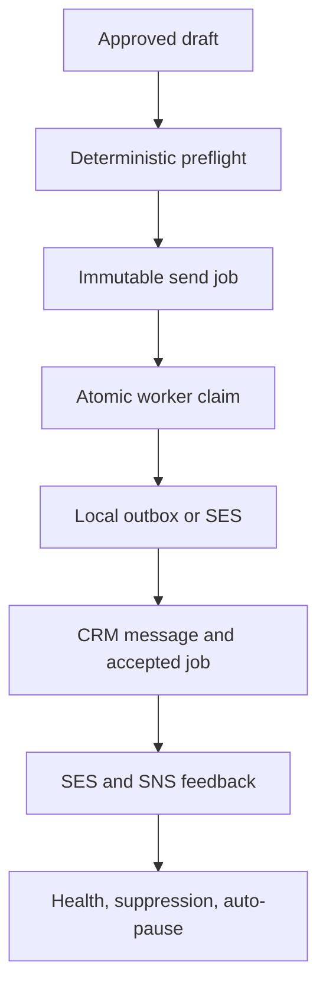

# Email delivery and deliverability controls

Status: **beta**. The deterministic policy, local provider, queue, worker,
one-click unsubscribe, SES adapter and SES-event parser are covered by automated
tests. A real AWS account, verified domain, SNS topic and mailbox-provider test
cohort are still required before calling a deployment production-ready.

## Problem and success criteria

The old sender safely handled small outreach, one synchronous run at a time. It
did not have the controls required for permission-based bulk mail: durable jobs,
domain authentication evidence, consent, global suppression, provider feedback,
reputation thresholds or one-click unsubscribe.

The feature succeeds when all of these are true:

1. A suppressed or permission-denied address cannot leave through either the
   legacy sender or the durable worker.
2. Permission marketing cannot queue without an active permission record, a
   stream-matched SES identity, an authentication check no older than seven
   days, SPF, DKIM, DMARC, alignment, a configuration set, an expected SNS
   topic and a public one-click unsubscribe endpoint.
3. A queued draft is immutable, claimed atomically and never sent by both paths.
4. A provider result whose state is ambiguous is quarantined for manual review,
   never retried automatically.
5. Hard bounces, complaints and unsubscribes suppress the address globally.
6. Feedback is idempotent and measured against accepted jobs; configured health
   thresholds pause the campaign.
7. Email-specific state never leaks into image, video or distribution campaign
   runners, and the sender still imports no AI module.
8. A reply or CRM stop cancels queued jobs, while temporary campaign pauses and
   closed send windows defer a claimed job without spending a provider attempt.

These criteria are assertions in `tests/test_email_delivery.py`, not product
claims inferred from the presence of code.

## Non-goals

- Bypassing spam filters or guaranteeing inbox placement.
- Sending scraped lists as permission marketing. Imports start as `unknown`.
- Building an SMTP server or maintaining IP space. Amazon SES is the bulk
  transport; Gmail remains the existing small-outreach transport.
- Deciding legal compliance. The product records basis and evidence but does
  not claim that a selected basis satisfies every jurisdiction.
- Using AI to make send-policy decisions. These rules are deterministic,
  inspectable and fail closed.

## Why a separate durable path is necessary

`OutreachEngine.run_due()` claims a draft, calls Gmail or the local outbox, and
records the result in one request. Raising its 500-message API limit would leave
long HTTP requests, no provider feedback and unsafe crash recovery. Amazon SES
does not offer a general idempotency token for `SendEmail`; after a connection
break, retrying blindly can duplicate a real email.

The durable path snapshots an approved draft into `email_send_jobs`, changes the
draft state to `queued`, and lets a bounded worker claim it with `BEGIN
IMMEDIATE`. A stale `sending` job is reconciled against the CRM message record.
If no record exists, it becomes `delivery_unknown` instead of returning to the
queue. That trades a possible missed email for never knowingly duplicating one.

## Architecture and data flow



The implementation lives in
`offsetx_apollo_builder/outreach/deliverability/`:

| File | Responsibility |
|---|---|
| `models.py` | Streams, reports and typed provider failures. |
| `store.py` | Email-only SQLite records, transactions, claims, rate state and health. |
| `preflight.py` | Consent, suppression, frequency, identity, authentication and send-window rules. |
| `unsubscribe.py` | Opaque HMAC tokens, footer rendering and RFC one-click headers. |
| `domain_auth.py` | SPF, DKIM and DMARC evidence through DNS-over-HTTPS plus SES identity evidence. |
| `ses.py` | Raw-MIME SES v2 adapter using the optional AWS SDK. |
| `events.py` | SNS signature verification, SES event parsing, suppression and health updates. |
| `service.py` | Queue and worker orchestration. |

`api/email_delivery.py` owns the HTTP surface. `email_worker_cli.py` is the
separate worker entry point. `OutreachEngine` only invokes the shared preflight
for its legacy path; it still contains no provider feedback or AI logic.

## Business rules

| Stream | Permission rule | Transport rule | Unsubscribe rule |
|---|---|---|---|
| Permission marketing | Active recorded grant | Verified, stream-isolated SES identity | Footer plus RFC 8058 headers required |
| Targeted outreach | Unknown is allowed with a warning; denied is blocked | Gmail for small outreach, SES or local test as configured | Public footer is mandatory for SES bulk use |
| Transactional | Recorded customer/service relationship | SES or local test | List unsubscribe is not added |

Every stream also applies global suppression, campaign status, send window,
contact frequency cap and health pause. An identity belongs to exactly one
stream, and an active sending domain cannot be assigned to two streams. Reusing
a permission-marketing identity or domain for targeted outreach is a blocker,
not a warning. Transactional mail requires a customer, contract or
service-request relationship; a marketing-consent label alone is insufficient.

## Storage

Schema version 9 adds only email-specific tables:

- `email_sending_identities`
- `email_campaign_settings`
- `email_contact_permissions`
- `email_suppressions`
- `email_unsubscribe_tokens`
- `email_send_jobs`
- `email_rate_state`
- `email_delivery_events`

No AWS access key or secret is stored in these tables. Boto3 uses the normal AWS
credential chain, so deployment should prefer an instance/task role. Provider
configuration stores region, configuration-set name, identity and expected SNS
topic ARN only.

## Job states and retry policy

| State | Meaning | Automatic next step |
|---|---|---|
| `queued` | Durable and eligible after `available_at` | Atomic claim |
| `sending` | Leased by one worker | Provider call |
| `retry_wait` | Provider explicitly returned a retryable refusal | Exponential/Retry-After backoff, maximum five attempts |
| `accepted` | Provider returned a message ID and the CRM message is recorded | Wait for feedback |
| `delivered` / `deferred` | Provider feedback | Health update |
| `blocked` | Re-preflight failed after queueing | Operator fixes policy/data |
| `failed` | Definite permanent failure or exhausted safe retries | Manual review |
| `delivery_unknown` | Provider may have accepted before the worker lost certainty | Manual reconciliation; no automatic retry |
| `cancelled` | Operator cancellation before sending | None |

Rate state is durable per provider/identity lane. Worker cycles are bounded,
identity batch size is enforced, and 429/5xx responses honor `Retry-After` when
present. The established campaign daily cap applies to both legacy and durable
sends and is evaluated in the campaign's own timezone. A closed send window or
temporary campaign pause returns a claimed job to `retry_wait` without counting
it as a provider attempt.

## Provider feedback and reputation

SES events accepted: send, delivery, delay, permanent/transient bounce,
complaint, reject and rendering failure. SNS envelopes are rejected unless:

- the topic ARN matches a configured, non-archived identity;
- the signing-certificate URL is HTTPS on an SNS AWS domain;
- the certificate is time-valid; and
- the RSA signature matches the exact SNS canonical field order.

Hard bounce and complaint events immediately add a global suppression.
Unsubscribe does the same and cancels queued jobs. Health uses accepted jobs as
the denominator and unique job/event identities as numerators. Auto-pause runs
only after the configured minimum sample.

Defaults are deliberately conservative but configurable: 5% hard bounce,
0.1% complaint, 100 accepted messages. They are operational stop thresholds,
not a promise that mailbox providers use identical thresholds.

## HTTP and CLI surface

- identity list/upsert/check
- per-campaign email settings and preflight
- durable enqueue, list, cancel and bounded work cycle
- campaign health and explicit resume
- permission record and global suppression management
- public one-click unsubscribe GET/POST
- public, signature-verified SES/SNS event ingress
- `offsetx-email-worker` for a separate polling process

Live SES queueing requires the exact phrase `QUEUE LIVE EMAILS`. Gmail retains
the existing `SEND LIVE EMAILS` confirmation and is intentionally excluded from
the durable bulk worker.

The existing reply-sync path remains the inbound source of truth. When it marks
a contact replied, queued durable jobs and unsent drafts are cancelled. The
worker checks that CRM state again immediately before its provider call.

## Deployment

Install the optional SES adapter:

```bash
uv sync --extra email --locked
```

Configure:

```env
OFFSETX_PUBLIC_BASE_URL=https://crm.example.com
OFFSETX_UNSUBSCRIBE_SECRET=<at-least-32-random-bytes>
```

Then configure an AWS credential source outside the CRM, a verified SES domain,
a configuration set that publishes delivery events, and an SNS HTTPS
subscription pointing to:

```text
https://crm.example.com/api/v1/email-delivery/events/ses/sns
```

Run the worker separately from the web process:

```bash
uv run offsetx-email-worker --watch --max-jobs 25 --poll-seconds 2
```

SQLite is appropriate for the current single-workspace product. A shared
multi-worker SaaS deployment needs the CRM store moved to PostgreSQL before
horizontal worker scaling.

## Evaluation evidence and remaining validation

Automated evaluation covers policy refusal, queue immutability, atomic claims,
crash quarantine, direct-path suppression, reply cancellation, temporal
deferral, event idempotency, health pause/resume, DNS evidence and freshness,
MIME headers, SNS signatures, API flow and public unsubscribe. The complete
local verification is recorded in `BUILD_STATE.md`; live provider validation
remains a release gate.

Still required in the target production environment:

1. SES mailbox-simulator success, bounce and complaint runs.
2. A real SNS subscription-confirmation and signed-notification run.
3. SPF/DKIM/DMARC checks against the production domain.
4. A permissioned seed cohort across Gmail, Outlook and Yahoo, measuring
   acceptance, delivery, bounce, complaint and unsubscribe rates.
5. Load and recovery tests on the actual deployment disk/database.
6. A deliberate domain/IP warm-up plan using conservative operator-set caps;
   automatic warm-up scheduling is not built.
7. Identity-wide reputation aggregation if several campaigns will share one
   sending identity; the current automatic threshold is per campaign.

No cost or latency number is claimed in this document because both depend on
AWS region, account quota, network and workload, and no live AWS run was made in
this implementation session. Local policy/queue performance can be benchmarked
independently, but it does not predict provider delivery latency.

## Standards and provider references

- [Gmail email sender guidelines](https://support.google.com/mail/answer/81126)
- [RFC 8058 one-click unsubscribe](https://www.rfc-editor.org/rfc/rfc8058)
- [Amazon SES SendEmail v2](https://docs.aws.amazon.com/ses/latest/APIReference-V2/API_SendEmail.html)
- [Amazon SES event publishing](https://docs.aws.amazon.com/ses/latest/dg/monitor-using-event-publishing.html)
- [Amazon SNS message-signature verification](https://docs.aws.amazon.com/sns/latest/dg/sns-verify-signature-of-message.html)
